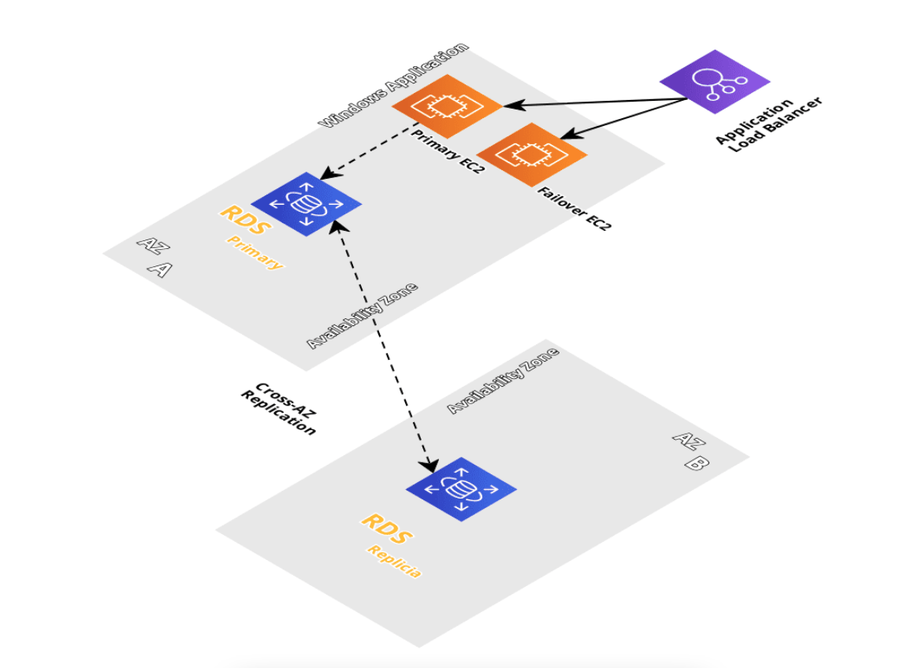

# A simple diagram about the solution:



# Prerequisites to run example Infrastructure 
* Create 2 S3 Buckets, one for storing all the conf/installation scripts *(example name:example-app-files)* and a second bucket for the Terraform state files *(example name: example-app-tfstate)*
* To have or create a VPC with at least 3 subnets (on different AZ's) where the resources are going to be created.
* Create key pairs on AWS to access via RDP to the Windows EC2 instances.
* Install terraform in the machines that will execute. *(Ref: https://learn.hashicorp.com/tutorials/terraform/install-cli)*
* Install terragrunt in the machines that will execute. *(Ref: https://terragrunt.gruntwork.io/docs/getting-started/install/)*
* Install AWS CLI. *(Ref:https://docs.aws.amazon.com/cli/latest/userguide/getting-started-install.html)* in the machines that will execute.
* To have or create a IAM user with admin permissions to create and manage the AWS resources.
# How to create example Infrastructure
## AWS example variables and parameters
Since the development of the TF templates and all of the infrastructure was done on a Bairesdev AWS account, information like vpc id, subnets, ip’s... is specific for our
environment.
This list of parameters are the ones that needs to be modified in the variables file on Terraform in order for example team to spin up the AWS components on their environment:
* VPC ID
* Subnet ID
* AMI ID
* Key Pairs
* Region
* Availability Zone
* Terraform state bucket path *(changed in terragrunt file)*

Before we start, please make sure you don't see any .terraform file in the terraform modules, if so, please proceed to delete them. 
1. With your IAM programmatically credentials, login to  AWS CLI running:
```shell
aws configure
 ```

2. Run the following terragrunt command to initialize Terraform modules 
```shell
 terragrunt init 
 ```
3. Run the following terragrunt command to plan all the infrastructure that terraform will deploy on AWS:
```shell
 terragrunt plan 
 ```
4. Run the following terragrunt command to deploy all your example modules to AWS.
```shell
 terragrunt run-all apply --auto-approve 
 ```
5. Test all your AWS resources have been created by Terraform.

6. To delete the infrastructure created by Terraform, run the command:
```shell
 terragrunt run-all destroy --auto-approve 
 ``` 
# How to use AWS Secrets Manager
AWS Secrets Manager is used to store sensitive information like passwords, keys, endpoints... and use it securely in scripts, files and templates wihtout harcoding or having it in plain text.

These are the steps to create a new secret:
* Open the secrets manager console at https://console.aws.amazon.com/secretsmanager/
* Chose Store a new secret:
  * For Secret type, choose Other type of secret
  * Create a key/value pair to store the data that will be saved in json format
  * For the encryption key select aws/secretsmanager as the default choice
  * Click on Next
* Enter a name and optional description for the secret
* Give proper permissions to the role that is going to call or use the secret (explained with more detail next)
* Choose next and then store to create the secret

## Secret access and permissions
In order to access the secret we need to give permissions to the role or IAM user that will use it and to do that we need to edit the secret's permissions and add this policy, modifying the ARN with the role or roles we wanted to have access:
```{
  "Version": "2012-10-17",
  "Statement": [
    {
      "Effect": "Allow",
      "Principal": {
        "AWS": "arn:aws:iam::AccountId:role/EC2RoleToAccessSecrets"
      },
      "Action": "secretsmanager:GetSecretValue",
      "Resource": "*"
    }
  ]
}
```
## Retrieve secret's value in powershell
Once we created the secret and gave proper permissions to access it from a specific role we can retrieve it's value to use it in scripts or templates. Here is an example of how to use it in powershell:
* We first need a library to be installed in our system to use the command we need for managing aws secrets manager, we can install from here:

https://www.powershellgallery.com/packages/AWS.Tools.SecretsManager/4.1.78
* Use this command to retrive the secret's value replacing the secrets ARN and KEY from the key/value pair we created, we can store it in a variable like this:

```$password= Get-SECSecretValue -SecretId arn:secret_arn_here -Select SecretString | ConvertFrom-Json | Select -ExpandProperty KEY ```
