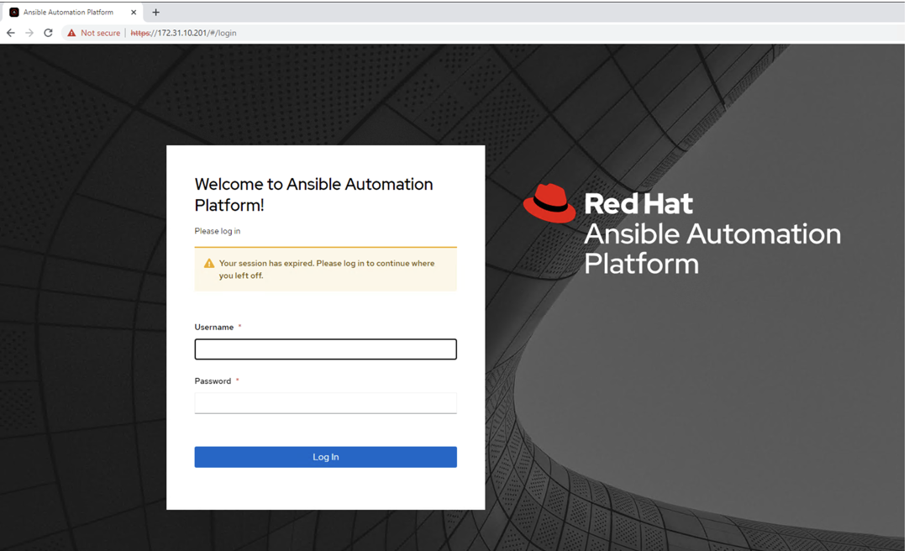
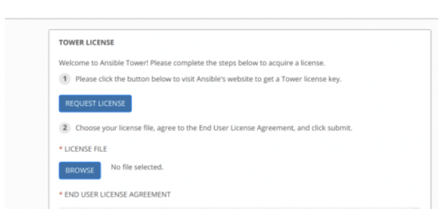
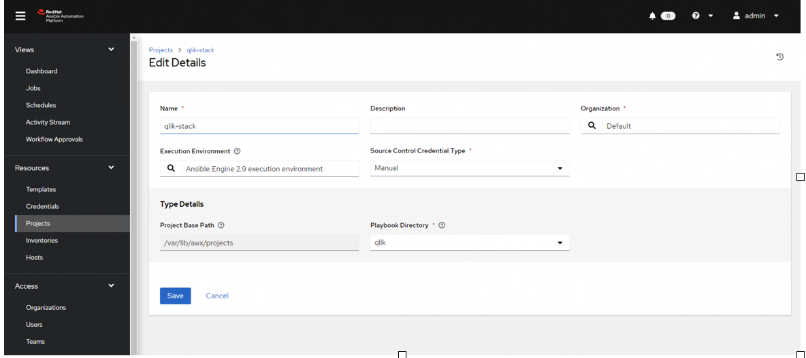
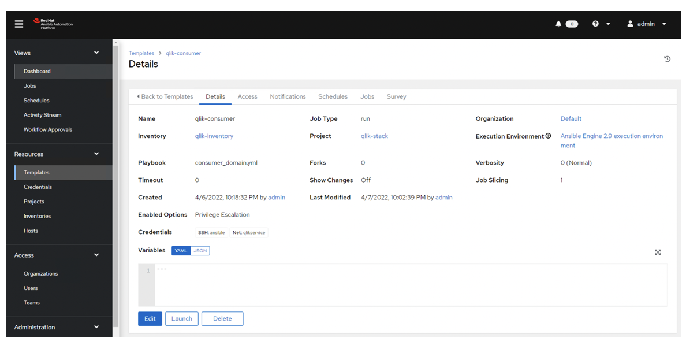
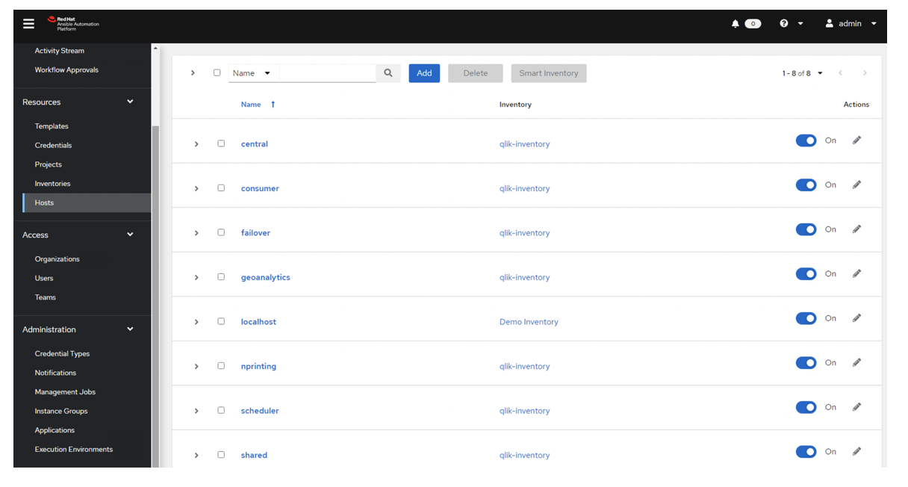
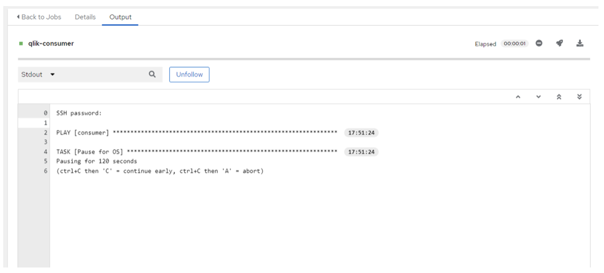
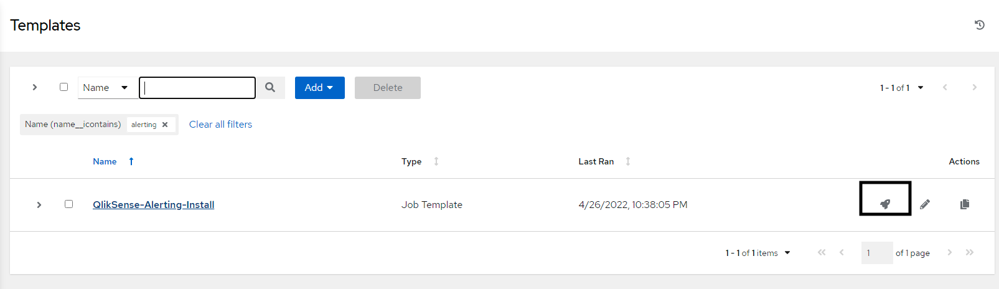

# Creating Ansible Tower

1. To deploy Ansible Tower, we need to deploy IaC module *ansible-tower* using Terraform or Terragrunt.

2. After creating Ansible Tower IaC, we can login in the Ansible Tower Console, to activate the software (you will need your Red Hat account, with Ansible Tower license).

Login credentials are defined on user_data.tpl script within the Ansible Tower module and they can be changed as it requerid.

3. Then you would need to activate the Ansible Tower Software.

To make Ansible Tower work, we need to create basically 5 things: a project, an inventory, a hosts file, a template and the playbook that you want to run.

## Project

In the project section, you configure the variables and paths from this project.

## Inventory 

In the inventory, you need to put the name and the IP address of the host you want to configure 

## Template

To configure a new Template, you need have a YAML in the path directory you define on the **Project** section.
+ **Name**: Name you'll assign to the template.
+ **Description**: A brief description of what template is doing.
+ **Inventory**: Inventory you created in the ##Inventory## section
+ **Project**: Projecto you created in the ##Project## section
+ **Playbook**: Playbook you're going to run. *(Go to Playbooks section for more information)*
+ **Credentials**: Credentials you'll use to execute the template.

## Hosts

The hosts file it's just a name definition to use on the inventory. If you want to add a host, go to add botton and fill as follow:
+ **Name**: DNS Name or IP Address.
+ **Inventory**: Inventory which the host will be part
+ **Description**: A brief description of the host.

### Yaml Section
Here you can configure a YAML file that define parameters such as: 
---
+ hostname
+ domain
+ domainuser
+ userpass

## Playbooks

For the playbook section, we need to put all the files you want to use on the project, in the path defined on the project step. Scripts and Playbook are included on *playbook.zip* file.

To execute the playbook, you need to click on the rocket icon and Ansible will execute the template you defined.

