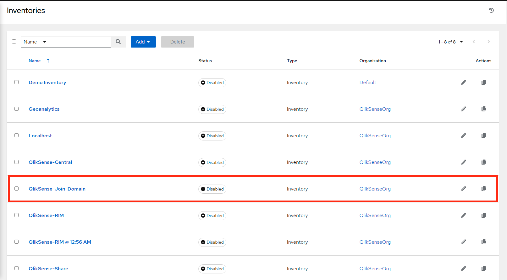
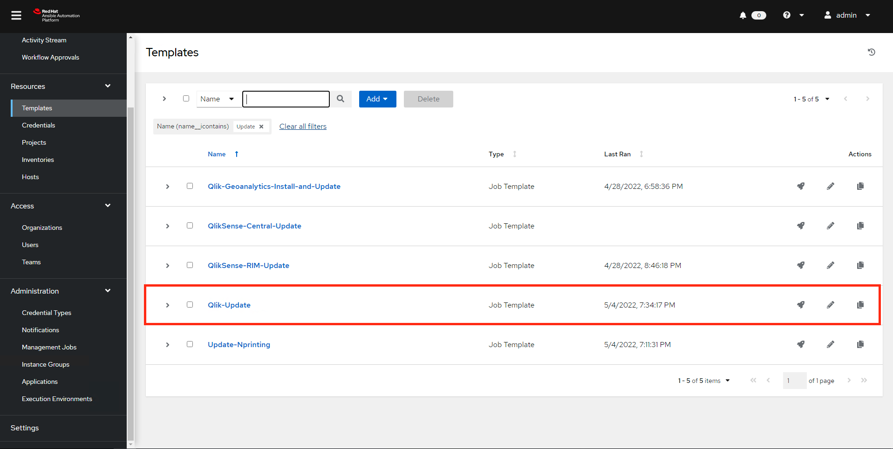

# Creating Central Node
1. Use terraform or terragrunt to deploy Central node on AWS.

2. Go to Ansible Tower and execute exampleSense-Join-Domain playbook.

3. Go to Ansible Tower and execute exampleSense-Central-Install playbook.

# Upgrading Central Node

1. To update the Scheduler node, run the playbook called example-Update.

